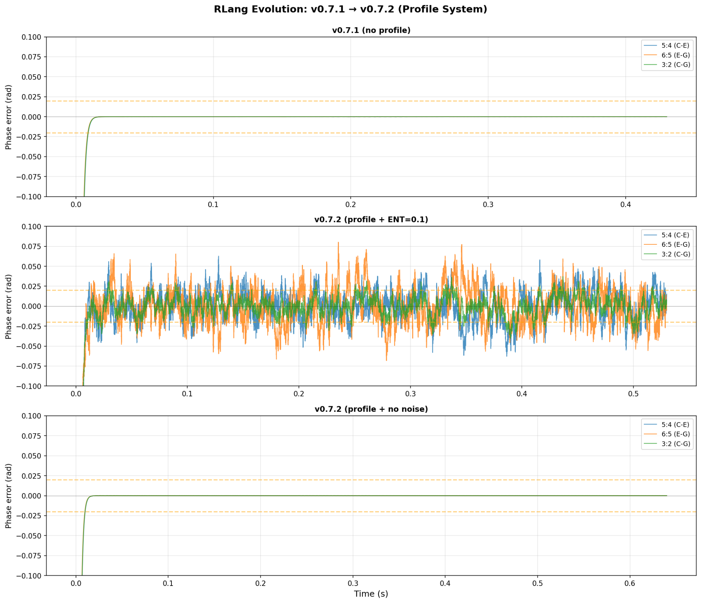
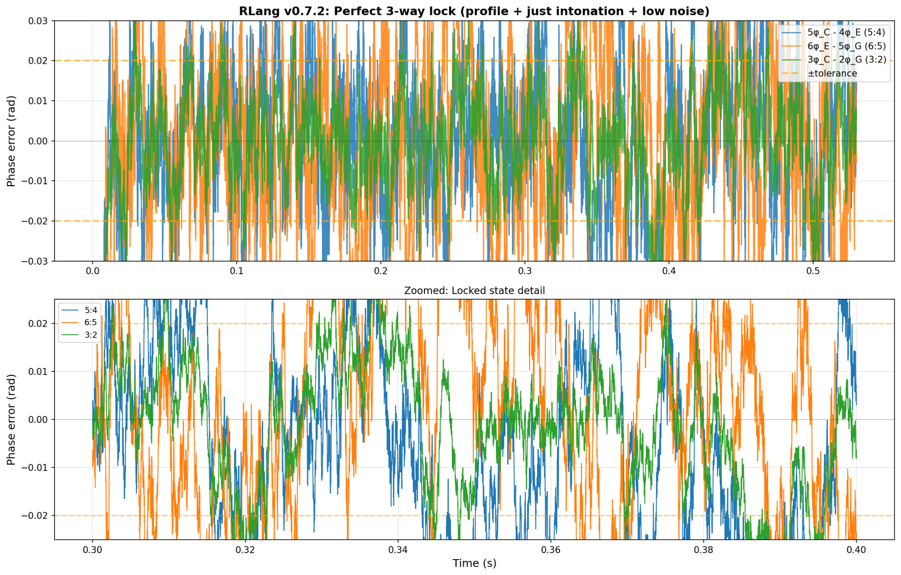
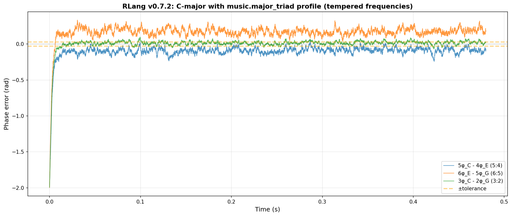

# RLang FastDrop — Harmonic Engine Core (v0.1.6)

**RLang FastDrop** is the high-performance runtime of the **RLang Framework** — a system for
*resonant, time-coupled dynamics* across music, neuroscience, physics, robotics, and simulation.

While the original RLang DSL (Python) focuses on expressiveness and semantics, **FastDrop** is its
**C++ execution layer**: optimized, embeddable, and ready for real-time engines, scientific stacks,
or the web (WASM).

---

## Why RLang

Modern computation excels at precision, but struggles with **resonance** — systems that adapt, synchronize,
and self-organize through time. RLang brings a **harmonic abstraction** to modeling coupled processes:

> “Every coupled process can be treated as a chord of information.”

**FastDrop** turns that into production code with:
- SIMD-accelerated integration (AVX2)
- Multi-threaded job scheduler
- Optional CUDA backend (GPU execution)
- Real-time audio synthesis (WAV)
- WASM / Emscripten build
- Profile system for domain heuristics (music, neuro, robotics)
- Optimizers (Adam; room for CMA-ES, LM, etc.)

---

## Architecture Overview

```
RLang DSL (.rlang)
   ↓ Parse / Compile / Export
FastDrop Runtime (C++17)
   ↓
CPU  /  GPU  /  WASM  /  Audio
```

### Core Modules
| Module | Purpose |
|-------|---------|
| `include/rlang_fast_simd.hpp` | SIMD phase integrator + system API |
| `include/rlang_audio.hpp` | Minimal WAV writer to hear locking |
| `tools/phase_view_interactive.py` | Plot p:q errors, detect lock intervals |
| `examples/` | Ready-to-run demos (triad, optimizer, ECS stub) |
| `docs/` | Figures (evolution, lock, tempered) for the README |

---

## Quick Start

```bash
git clone https://github.com/yourname/rlang-fastdrop.git
cd rlang-fastdrop
cmake -S . -B build -DRLANG_AVX2=ON
cmake --build build -j

# Minimal demo — generates triad_lock.wav
./build/triad_lock
```

**Outputs**
- `triad_lock.wav` — a C-major triad; listen to the phase-locked chord
- `phase_trace.bin` — optional binary trace for tools

---

## Minimal C++ Example

```cpp
#include "rlang_fast_simd.hpp"
#include "rlang_audio.hpp"
#include <vector>
#include <cmath>

int main(){
    rlangf::System sys;
    auto C = sys.add_osc(264.0,0.0,0.01,0.0,0.8);
    auto E = sys.add_osc(330.0,0.5,0.01,0.0,0.7);
    auto G = sys.add_osc(396.0,1.0,0.01,0.0,0.7);
    sys.couple_k(C,E,60.0,5,4);
    sys.couple_k(E,G,60.0,6,5);
    sys.couple_k(C,G,60.0,3,2);

    const int sr = 44100;
    const double dt = 1.0 / sr;
    const double T = 2.0;
    std::vector<float> mono; mono.reserve(int(T*sr));

    for(int i=0;i<int(T*sr);++i){
        sys.step_jobified(dt, 0, true);
        double s = std::sin(sys.osc.phase[C]) + std::sin(sys.osc.phase[E]) + std::sin(sys.osc.phase[G]);
        mono.push_back(float(s/3.0));
    }
    rlangf_audio::write_wav16("triad_lock.wav", mono, sr);
}
```

---

## Visual Results

| Evolution | Perfect Lock | Tempered Frequencies |
|:--:|:--:|:--:|
|  |  |  |

---

## Contributing

Pull requests are welcome. Please open an issue to discuss major features first.

Guidelines:
- Stick to C++17; keep dependencies minimal.
- Use `clang-format` for consistency.
- Add short Doxygen comments for new public APIs.

---

## License

See **LICENSE** (RHL-1.0). When used in non-commercial contexts, attribute:

> “Built on Rlang by Damjan Žakelj (2025) under RHL-1.0.”

For permissions or commercial use, contact **zakelj.damjan@gmail.com**.
